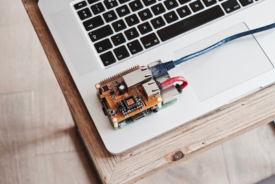

[center]

一台没有附加组件的树莓派，大约在 300RMB 左右，还可以自己搭配需要的配件。

必须的配件:
- 一块树莓派版
- 散热铜块
- TF 内存卡(小卡)
- 风扇散热
- 电源数据线

## 组装
- 散热片贴在 cpu 和以太网卡上，背面还要贴一个。


- 插上风扇红线接在 DSI 接口一端，吹风口对着 CPU 装好螺丝。


- 盖上盒子，插上装好系统的 TF 储存卡。


## 在 TF 卡上装树莓派系统
1. 首先在树莓派官网下载镜像  [下载地址](https://www.raspberrypi.org/downloads/raspbian/)
    - Raspbian Stretch Lite ——轻量版(无桌面环境)
    - Raspbian Stretch with desktop ——桌面版(带可视化桌面，可以连接 HDMI显示器)
    - Raspbian Stretch with desktop and recommended software —— 完整版(附带推荐软件)
2. 格式化tf卡 
    - Windows 系统的格式化会使树莓派系统出错，推荐一个格式化工具 [SD Card Formatter](https://www.sdcard.org/downloads/formatter_4/eula_windows/index.html)。
    - 下载安装后，直接选择 TF 卡，点击 Format 就可以。
3. 写入系统镜像
    - 下载[win32diskimager](https://sourceforge.net/projects/win32diskimager/)镜像写入工具。
    - 安装完成后，选择镜像文件，选择 TF 卡，点击`写入`，等待操作完成。
    - 写入完成之后不要在格式化 TF 卡，否则会造成系统损坏(有时候系统会提示格式化，请忽略)。
4. 设置 WiFi和 SSH
    - 如果没有显示器，可能无法操作树莓派，所以在插入 TF 卡之前先要在`/boot `目录下创建一个配置文件`wpa_supplicant.conf`，开启 WiFi 和 SSH 连接。
    - 开启 SSH 直接在/boot 目录创建 ssh 空文件，没有后缀。
    - Mac 可以用命令行`vim /boot/wpa_supplicant.conf`
    - Windows 可疑新建文本文件，然后修改后缀。

```bash
# 文件内容
country=CN
ctrl_interface=DIR=/var/run/wpa_supplicant GROUP=netdev
update_config=1

network={
    ssid="WiFi 名"
    psk="密码"
    # (加密方式)
    key_mgmt=WPA-PSK
    # (优先级)
    priority=1
}
```
配置完成之后直接装卡，开机。
默认的用户名：`pi`，默认密码：`raspberry`。
`ssh pi@ip地址`
Tips:
- 如果无法查看树莓派地址，可以使用 nmap 命令行工具(扫描局域网所有主机 IP 地址)。首先查找本机电脑的 ip 段，使用 `ifconfig`命令。比如，本机为 192.168.1.100，可以用`nmap -sn 192.168.1.0/24`来查看家里所有设备的 IP，然后尝试使用 SSH 连接。